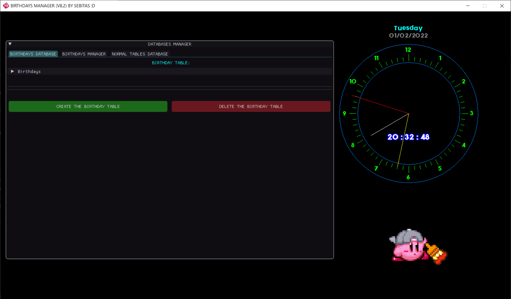

<h1 align="center"> 🎁 BIRTHDAY MANAGER 🎉 </h1>

  
🌟🌟🌟 HOW TO BUILD AND RUN THE GAME 🌟🌟🌟

## Requirements
- Visual Studio with C++ tools installed.
- Windows OS.

## Build Instructions
There are two build scripts in the `tools` folder:

- **Release build:**  
  `tools/release_compiler.bat`

- **Debug build:**  
  `tools/debug_compiler.bat`

Run the desired script to generate the executable and object files.

## Run Instructions
After building, you can run the game using the corresponding script:

- **Release version:**  
  `RUN_BIRTHDAY_MANAGER_release.bat`

- **Debug version:**  
  `RUN_BIRTHDAY_MANAGER_debug.bat`

Alternatively, you can directly run the executable from the `bin/release` or `bin/debug` folders.

---

🌟🌟🌟 HISTORY VERSIONS 🌟🌟🌟

- **VERSION 8.2.2** (16/11/2022)  
  · Dates reorderer from DD-MM-YYYY to YYYY-MM-DD

- **VERSION 8.2.1** (18/03/2022)  
  · Fixed a bug with "Seconds Lived" (changed from `int` to `unsigned long int`)

- **VERSION 8.2** (24/01/2022)  
  · Fixed crash if there’s no birthday database

- **VERSION 8.1** (15/01/2022)  
  · Fixed time variables for birthdays of the current month

- **VERSION 8.0 (FINAL)** (09/01/2022)  
  · Updated `window.h` with `setIconWindow`  
  · Added Kirby icon to the window  
  · Minor fixes

- **VERSION 7.0** (02/01/2022)  
  · Birthday Database and Manager working  
  · Unified Clock + Database Manager + Birthday Database

- **VERSION 6.0** (26/12/2021)  
  · Unified Clock + Database Manager

- **VERSION 5.0** (25/12/2021)  
  · Added ImGui to the Clock  
  · Added sound to the Clock  
  · Clock Finished :D

- **VERSION 4.0** (25/12/2021)  
  · Clock circle done

- **VERSION 3.0** (25/12/2021)  
  · Clock animation working

- **VERSION 2.0** (25/12/2021)  
  · Clock needles working

- **VERSION 1.0** (22/12/2021)  
  · Seconds counter done
