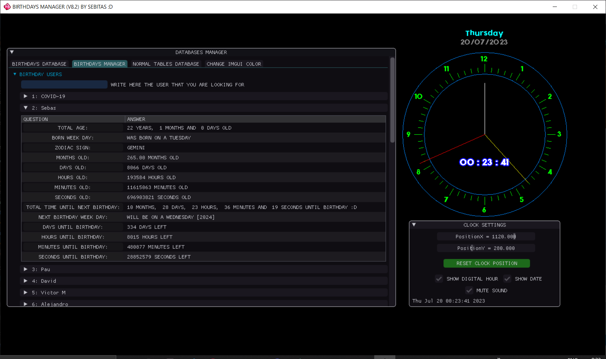

<h1 align="center"> 🎁 BIRTHDAY MANAGER 🎉 </h1>

  
🌟🌟🌟 HOW TO BUILD AND RUN THE GAME 🌟🌟🌟

## · Requirements
    · Visual Studio with C++ tools installed.
    · Windows OS.

## Build Instructions
There are two build scripts in the `tools` folder:

  - **Release build:**  
    `tools/release_compiler.bat`

  - **Debug build:**  
    `tools/debug_compiler.bat`

Run the desired script to generate the executable and object files.

## Run Instructions
After building, you can run the game using the corresponding script:

  - **Release version:**  
    `RUN_BIRTHDAY_MANAGER_release.bat`

  - **Debug version:**  
    `RUN_BIRTHDAY_MANAGER_debug.bat`

---

🌟🌟🌟 HISTORY VERSIONS 🌟🌟🌟

| Version | Date       | Changes |
|---------|------------|---------|
| 8.2.2   | 16/11/2022 | Dates reorderer from DD-MM-YYYY to YYYY-MM-DD |
| 8.2.1   | 18/03/2022 | Fixed bug with "Seconds Lived" (`int` → `unsigned long int`) |
| 8.2     | 24/01/2022 | Fixed crash if there’s no birthday database |
| 8.1     | 15/01/2022 | Fixed time variables for birthdays of the current month |
| 8.0     | 09/01/2022 | Updated `window.h` with `setIconWindow`; added Kirby icon; minor fixes |
| 7.0     | 02/01/2022 | Birthday Database and Manager working; unified Clock + Database Manager + Birthday Database |
| 6.0     | 26/12/2021 | Unified Clock + Database Manager |
| 5.0     | 25/12/2021 | Added ImGui and sound to the Clock; Clock Finished :D |
| 4.0     | 25/12/2021 | Clock circle done |
| 3.0     | 25/12/2021 | Clock animation working |
| 2.0     | 25/12/2021 | Clock needles working |
| 1.0     | 22/12/2021 | Seconds counter done |

